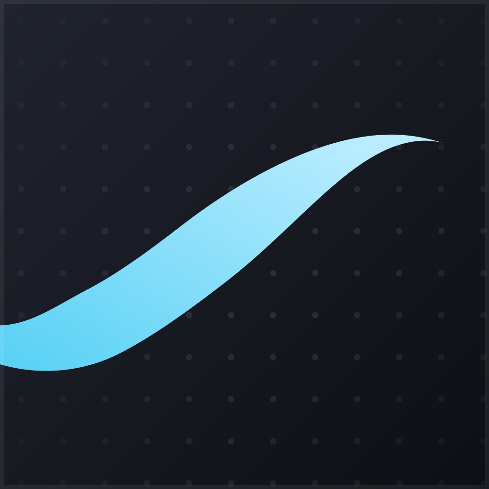

<div align="center">



# betterboard

**An infinite whiteboard desktop app built for pen displays.**<br>
*Pressure-sensitive ink, endless canvas, zero friction.*

</div>

---

betterboard is a desktop whiteboard for macOS and Linux (x64 and arm64), designed around drawing tablets like the Huion Kamvas Pro. Strokes are stored as vectors — pressure-weighted centerlines rendered with [perfect-freehand](https://github.com/steveruizok/perfect-freehand) — so the canvas is truly infinite, zooming is lossless, and erasing works per stroke.

## Features

- **Four brushes** — **pen** (pressure-tapered ink), **pixel** (snaps to a shared world grid, so separate strokes and separate sessions line up — real pixel art), **marker** (flat chisel tip, translucent, builds up where strokes cross) and **paint** (a dry bristle brush with a solid body and frayed edges). Stroke width follows stylus pressure via Chromium pointer events; mouse strokes fall back to velocity-simulated pressure
- **Infinite canvas** — pan, zoom, and rotate freely, with an adaptive dot grid that follows the view
- **Stylus-native gestures** — the pen's eraser end erases, the barrel button pans, touch pans
- **Stroke eraser** — removes whole strokes, one undo step per gesture
- **Lasso select** — loop your pen around anything to select it, then drag the marching-ants outline to move it; `⌫` deletes the selection, `Esc` drops it
- **Layers** — add, delete, rename, reorder by dragging, hide, and dim. Opacity composites the finished layer rather than each stroke, so overlaps never show seams — drop a sketch to 30% and ink over it cleanly. Drawing, erasing and selecting stay on the active layer, so what's underneath is safe
- **Animation** — a timeline of frames, each with the full layer stack. Add, duplicate, delete and drag frames into order, set the frame rate, and play the loop back. Onion skinning ghosts the frames either side, tinted red behind and teal ahead, with adjustable reach and strength
- **Images** — paste from the clipboard, drop files onto the board, or insert from disk. They land on the active layer and frame, interleaved with your ink in the order you made things, so you can draw over a reference or paste a screenshot on top of notes. Drag to move, drag a corner to scale, `⌫` to delete
- **Ask Claude** — box any part of the board and ask about it. The crop is re-rendered clean (no grid, no onion ghosts, no selection outlines) and sent with your question; the reply streams into a narrow side panel you can keep asking follow-ups in
- **Normalize zoom** — one press rebases the current view as the new 100%, restoring the full zoom range without moving a pixel; when you hit the zoom-out floor, the button pulses to offer it
- **Undo / redo**, dark & light board themes, autosave and session restore
- **Save / open** boards as JSON, **export** the current frame's visible layers as PNG

## Install

```sh
make
```

One command on either platform; `make update` rebuilds and reinstalls in one step.

- **macOS** — installs `BetterBoard.app` into `/Applications` and launches it.
- **Linux (incl. arm64 Ubuntu)** — installs to `~/.local/opt/betterboard` with a `betterboard` command on your PATH, a desktop entry, and an icon. On Ubuntu 24.04+ the install asks for sudo once to setuid Electron's `chrome-sandbox` (the kernel restricts unprivileged user namespaces there).

Keyboard shortcuts below are written with macOS keys; on Linux read `⌘` as `Ctrl`.

## Develop

```sh
bun install     # dependencies
bun run dev     # build renderer + launch Electron
bun run build   # typecheck + bundle (production build)
```

The renderer is plain TypeScript on a 2D canvas (no framework), bundled with `bun build`. The Electron main process lives in `src/main`, the renderer in `src/renderer`.

## Controls

| Action | Input |
|---|---|
| Draw | Pen or left mouse drag |
| Erase | `E`, the stylus eraser end, or eraser tool |
| Select an area | `S`, then loop the pen around it (tap a stroke to select just that one) |
| Move a selection | Drag from inside the outline |
| Delete / drop a selection | `⌫` / `Esc` |
| Pan | Space + drag, `H`, middle/right drag, pen barrel button, touch, or two-finger scroll |
| Zoom | Pinch, `⌘` + scroll, `⌘+` / `⌘−` / `⌘0`, or the zoom pill |
| Zoom to fit | `⌘1` |
| Normalize zoom | `⇧⌘N` or the ⤢ button in the zoom pill |
| Rotate | hold `R` and drag the dial — snaps near 45° steps; double-click the dial to reset, `⌘1` also squares the view |
| Brushes | `1` pen · `2` pixel · `3` marker · `4` paint |
| Tools | `B`/`P` draw · `E` toggles eraser/pen · `S` toggles lasso/pen · `H` hand |
| Ask Claude about a region | `A`, then drag a box (or `⌥⌘A`) |
| Send · newline · new thread | `Enter` · `⇧Enter` · `+` in the panel |
| Paste / insert an image | `⌘V`, drop a file on the board, or `⇧⌘I` |
| Move / scale / delete an image | Drag it · drag a corner grip · `⌫` |
| Timeline | `T` or `⌘T` |
| Play / pause | `Enter` (or `⌘↩`) |
| Previous / next frame | `←` / `→` |
| New / duplicate / delete frame | `⌥⌘F` / `⌥⌘D`, or `+` ⧉ 🗑 in the timeline |
| Reorder frames | Drag a frame cell |
| Frame rate · onion skin | The fps field · the ◐ button (`⌥⌘O`), then its sliders |
| Layers panel | `L` or `⌘L` |
| New / delete layer | `⌥⌘N` / `⌥⌘⌫`, or `+` and 🗑 in the panel |
| Hide / show a layer | The eye on its row, or `⌥⌘H` for the active one |
| Layer opacity · rename · reorder | The panel slider · double-click its name · drag its row |
| Stroke size | `[` and `]` or the slider |
| Undo / redo | `⌘Z` / `⇧⌘Z` |
| New / open / save / export | `⌘N` / `⌘O` / `⌘S` / `⌘E` |
| Dot grid · board theme | `⌘G` · `⇧⌘L` |
| Clear frame | `⌘⌫` |

## Asking Claude

The Ask tool boxes a region, re-renders just that area as a PNG, and sends it with your question to the [Anthropic Messages API](https://docs.anthropic.com/en/api/messages). Replies stream into the side panel, and follow-ups keep the thread — the image is sent once, not with every turn.

It is entirely opt-in and off until you add a key: **File → Claude API Key…**, or the prompt in the panel. Worth knowing before you turn it on:

- The key is written to `settings.json` in the app's user-data directory with `0600` permissions. It never enters the renderer — requests are made from the main process — and only its last four characters are ever read back for display.
- Nothing leaves your machine unless you press Ask. What goes is exactly one thing: the cropped image and the messages in that thread. No other frames, layers, or board contents.
- Conversations are held in memory for the session only. They are not written into board files, so a `.betterboard.json` you share carries no chat history.
- Requests go to `api.anthropic.com` and nowhere else, and are billed to your own account. Sonnet is the default; Opus and Haiku are in the panel's picker.

## File format

Boards are JSON (version 5): lists of frames and of layers (`name`, `opacity`, `visible`, bottom-first), the frame rate and onion-skin settings, a list of strokes — each carrying its `color`, `size`, `brush`, a `seed` (so brushes with any randomness redraw identically), its owning `layer` and `frame`, and `[x, y, pressure]` points in world coordinates — and a list of images, embedded as data URLs so a board stays one portable file. Strokes and images share a running `seq`, which is what puts them back in the order you made them. Imports over 1600px on the long side are scaled down on the way in, since a few full-resolution screenshots would otherwise dwarf the drawing they annotate. Plus the camera. Frames and layers form a grid and every stroke sits in one cell of it. Older files still open, each filling in what it predates: version 4 has no images, version 3 no brushes (its strokes load as pen), version 2 no animation (it lands on a single frame), version 1 no layers either. Autosaves go to the app's user-data directory; `⌘S` exports a portable `.betterboard.json`.

## Roadmap

- Custom app icon
- Scale and rotate a selection, copy/paste between boards and frames
- Export an animation as GIF or video
- Shapes and text
- Pen tilt support
